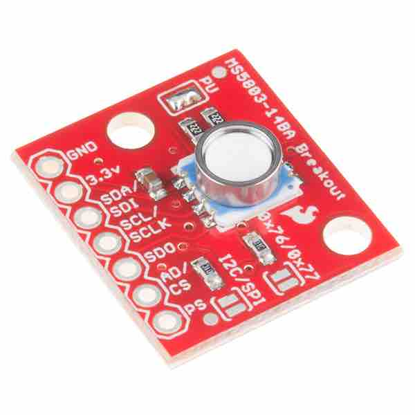

[](https://www.sparkfun.com/products/12909)

# ms5803py


Python 3 library for MS5803-14BA pressure sensor for Raspberry Pi over i2c.

Based off of the [Adafruit Arduino Library](https://github.com/sparkfun/MS5803-14BA_Breakout) and the [Control Everything Python Library](https://github.com/ControlEverythingCommunity/MS5803-14BA). Some of the math is complicated when correcting raw readings to actual temperatures and pressures, that math can be verified from the [MS5803-14BA datasheet](http://www.te.com/commerce/DocumentDelivery/DDEController?Action=showdoc&DocId=Data+Sheet%7FMS5803-14BA%7FB3%7Fpdf%7FEnglish%7FENG_DS_MS5803-14BA_B3.pdf%7FCAT-BLPS0013).

Supports reading the pressure and temperature values from the sensor at any of the supported OverSampling Rates (OSR). A higher OSR leads to greater resolution/accuracy but requires a longer conversion time. The supported OSR rates are [256, 512, 1024, 2048, 4096], also available at `MS5803.OSRs`.

## Installation
Available on PyPi, so you can install on your RPi using
````
pip3 install ms5803py
````
or clone this repository and run
```
python3 setup.py install
```

## Usage
The MS5803 and the RPi use the I2C protocol to communicate, so you need to have I2C set up on your pi, as explained in [this Adafruit tutorial](https://learn.adafruit.com/adafruits-raspberry-pi-lesson-4-gpio-setup/configuring-i2c). After that, the MS5803 needs to be hooked up to the Raspberry Pi as described in [this Adafruit tutorial](https://learn.sparkfun.com/tutorials/ms5803-14ba-pressure-sensor-hookup-guide).

After doing that, you must find the I2C address of your MS5803. To do this, run the following command both before and after plugging in the MS5803. Whatever address shows up is the one you want:
```
sudo i2cdetect -y 1
````
It should be either `0X76` or `0x77`, as described in the [MS5803-14BA datasheet](http://www.te.com/commerce/DocumentDelivery/DDEController?Action=showdoc&DocId=Data+Sheet%7FMS5803-14BA%7FB3%7Fpdf%7FEnglish%7FENG_DS_MS5803-14BA_B3.pdf%7FCAT-BLPS0013), depending on if the CSB (Chip Select) pin on the MS5803 is high or low. On the [Sparkfun breakout board](https://www.sparkfun.com/products/12909) the I2C address is `0x76`, so I have that set as the default if you don't specify an address when initializing the sensor.

See `python3 example.py` for an example of usage:
```
import ms5803py
import time

s = ms5803py.MS5803()
while True:
    # Do the batteries-included version, optionally specifying an OSR.
    press, temp = s.read(pressure_osr=512)
    print("quick'n'easy pressure={} mBar, temperature={} C".format(press, temp))

    # Use the raw reads for more control, e.g. you need a faster sample
    # rate for pressure than for temperature. Use a high OverSampling Rate (osr)
    # value for a slow but accurate temperature read, and a low osr value
    # for quick and inaccurate pressure readings.
    raw_temperature = s.read_raw_temperature(osr=4096)
    for i in range(5):
        raw_pressure = s.read_raw_pressure(osr=256)
        press, temp = s.convert_raw_readings(raw_pressure, raw_temperature)
        print("advanced pressure={} mBar, temperature={} C".format(press, temp))
    time.sleep(1)
```
results in:
```
quick'n'easy pressure=835.7 mBar, temperature=26.64 C
advanced pressure=835.3 mBar, temperature=26.64 C
advanced pressure=834.2 mBar, temperature=26.64 C
advanced pressure=835.3 mBar, temperature=26.64 C
advanced pressure=834.2 mBar, temperature=26.64 C
advanced pressure=834.2 mBar, temperature=26.64 C
quick'n'easy pressure=835.1 mBar, temperature=26.65 C
advanced pressure=835.3 mBar, temperature=26.63 C
advanced pressure=837.7 mBar, temperature=26.63 C
advanced pressure=834.2 mBar, temperature=26.63 C
advanced pressure=831.8 mBar, temperature=26.63 C
advanced pressure=835.3 mBar, temperature=26.63 C
...
```
